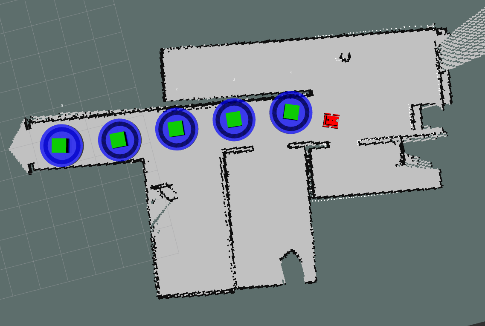

# WaypointsGenerator

A ROS Waypoint Generator using robot's estimated pose on the map and GPS localization. Inspired on the project [CIR-KIT Waypoint Manager](https://github.com/CIR-KIT/cirkit_waypoint_manager).

## Dependencies

* `requests` - Necessary to send the waypoints to a server. To install it:

        $ pip install requests

* `flask` - For running the test server. To install it:

        $ pip install flask

## Messages 

This project has two messages, `Waypoint` and `Waypoint Array`, which are implemented on the package `cirkit_waypoint_manager_msgs`.

## Nodes

* `cirkit_waypoint_generator`: This node checks for new GPS data on `"/fix"` and, each time it receives a new message, it checks for the robot's estimated position on map. If this new position on map has a distance or rotation to the last waypoint greater than a pre-defined threshold (`dist_th` and `yaw_th`) then this new position is a waypoint. These waypoints are added to a list and then published on the topic `"/waypoints"`. This node also allows to load points from a csv file.

* `cirkit_waypoint_saver`: This node subscribes to the `"/waypoints"` topic and store the received waypoints on a csv file.

* `cirkit_waypoint_server`: This node allows the user to load waypoints from a csv file and visualize them on RViz.

* `route_generator`: This node possess the function buildRoute, which is responsible for building a route based on a Waypoint IDs list. It also includes an example of usage, loading the waypoints from a file and building a pre-defined route.

* `transfer_waypoints`: This node loads waypoints from a csv file and send them to a server over a http request.

## Waypoint Storage - CSV File Format

The csv file must have one waypoint for each row and each of these rows must have the following format:

* id, x, y, z, Qx, Qy, Qz, Qw, status, status_service, latitude, longitude, altitude, covariance (9), covariance_type, is_searching_area, reach_threshold

## Examples

### Generate waypoints

Assuming `roscore` is already running.

    $ rosrun cirkit_waypoint_generator cirkit_waypoint_generator

Setting `yaw_th` to 3.14 rad and `dist_th` to 2.0 meters:

    $ rosrun cirkit_waypoint_generator cirkit_waypoint_generator _dist_th:=2.0 _yaw_th:=3.14

Loading waypoints from a csv file.

    $ rosrun cirkit_waypoint_generator cirkit_waypoint_generator --load path_to_csv_file.csv

### Save waypoints to csv

Assuming `roscore` and `cirkit_waypoint_generator` are already running.

    $ rosrun cirkit_waypoint_generator cirkit_waypoint_saver

This will generate a new csv file on the current directory with a name based on the current system time.

### Generate route

Assuming `roscore` is already running and there is a *.csv file with waypoints stored.

    $ rosrun cirkit_waypoint_generator route_generator _waypoints_path:=path_to_waypoints_file.csv

### Send Waypoints to a Server

Assuming `roscore` is already running.

    $ rosrun transfer_waypoints send.py _waypoints_file:=path_to_waypoints_file.csv

This node sends each of these waypoints on a JSON with the following fields:

```
{
    "name": "Ponto 4", // Waypoint's ID is 4
    "lat": 49.9, // Latitude
    "lng": 8.9, // Longitude
    "map_id": 1, // For now, this is always 1
    "x": , 6.22// x coordinate of robot's estimated position (meters)
    "y": , -3.13// y coordinate of robot's estimated position (meters)
    "teta": -1.63, // Rotation of robot's estimated position, equivalent to yaw (measured in radians)
}
```

For tests there are csv files on `transfer_waypoints/waypoints/`. Also for tests, there is a test server made using flask which receives the waypoints and print them on the screen. To run this test server:

    $ roscd transfer_waypoints
    $ python src/testServer.py

## Visualizing waypoints on RViz

While generating new waypoints using the node `cirkit_waypoint_generator` it's possible to check these waypoints on RViz subscribing to the following topics:

* `/cube/update` - Topic of type InteractiveMarkers. It shows a cube over each waypoint registered and a blue ring around it.

* `/reach_threshold_markers` - Topic of type MarkerArray. It shows a blue disk over the waypoint, representing a reach area around it.

